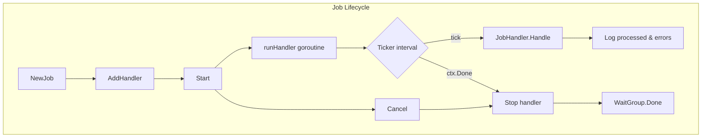
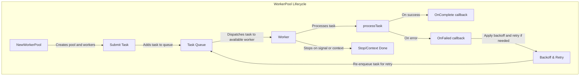
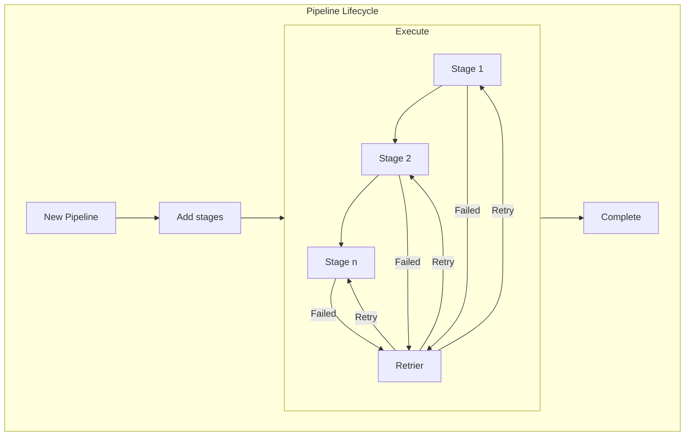

# Overview

The `efflux` module provides robust, concurrent job scheduling and worker pool management for background processing in Go applications. It is designed to help you run periodic tasks, batch jobs, and asynchronous workloads efficiently and safely.

Key features include:

- **Job Scheduling**:  
  The `Job` type lets you register multiple handlers, each with its own interval, and runs them concurrently. It supports graceful cancellation, panic recovery, and logging for reliable background operations.

- **Worker Pool**:  
  The `WorkerPool` type manages a pool of goroutines to process tasks in parallel. It supports retries with customizable backoff strategies, event callbacks for task lifecycle events, and generic task types for flexibility.

- **Concurrency and Safety**:  
  Both job scheduling and worker pools are designed for safe concurrent execution, using synchronization primitives and context-based cancellation.

- **Extensibility**:  
  The module is generic and can be extended to support any task type or job handler, making it suitable for a wide range of background processing scenarios.

Use `efflux` to simplify and standardize background task management, improve reliability, and scale concurrent workloads in your Go projects.

# Job
The `Job` type in the `efflux` package is a scheduler and coordinator for running multiple background tasks (handlers) at specified intervals. It is designed to manage periodic jobs, such as polling, batch processing, or maintenance routines, in a concurrent and robust manner.



## How Job Works

- **Initialization**:  
  Create a new `Job` instance using `NewJob()`. This initializes an empty set of handlers.

- **Adding Handlers**:  
  Use `AddHandler(cfg *HandlerConfig)` to register a handler. Each handler is an implementation of the `JobHandler` interface and is associated with its own interval (how often it should run).

- **Starting Jobs**:  
  Call `Start(ctx)` to begin execution. For each handler, a goroutine is started that runs the handler's `Handle` method at the specified interval using a ticker. All handlers run concurrently.

- **Stopping Jobs**:  
  The context passed to `Start` is used for cancellation. You can call `job.cancel()` to stop all handlers gracefully. Each handler will exit its loop when the context is cancelled.

- **Concurrency and Safety**:  
  The `Job` type uses a `sync.WaitGroup` to track running handler goroutines and ensure proper cleanup. Panics in handlers are recovered and logged, preventing one handler from crashing the entire job system.

- **Logging**:  
  After each handler execution, the number of processed items and any errors are logged using the project's logger.

## Example Usage

```go
job := NewJob()
job.AddHandler(&HandlerConfig{
    handler:  myHandler,
    interval: time.Second * 10,
})
job.Start(context.Background())
// ... later ...
job.cancel() // to stop all handlers
job.wg.Wait() // wait for all handlers to finish
```

## Handler Interface

Handlers must implement the following interface:

```go
type JobHandler interface {
    Name() string
    Handle(ctx context.Context) (processed int, err error)
}
```

- `Name()` returns the handler's name (for logging).
- `Handle(ctx)` performs the handler's work and returns the number of items processed and any error.


## Key Features

- Multiple handlers, each with its own interval
- Concurrent execution using goroutines
- Graceful cancellation via context
- Panic recovery and error logging
- Suitable for background scheduling and batch processing

---

# Worker Pool

The `WorkerPool` type in the `efflux` package is a generic, concurrent task processing system. It manages a pool of worker goroutines that process tasks of any type implementing the `Task` interface. This design is suitable for background processing, batch jobs, and systems requiring retries and backoff strategies.



## How WorkerPool Works

- **Initialization**:  
  Create a new worker pool using `NewWorkerPool(numWorkers, queueSize, handler, callbacks)`. This sets up a pool of workers and a buffered channel for incoming tasks.

- **Submitting Tasks**:  
  Use `Submit(task)` to add a task to the pool's queue. Tasks must implement the `Task` interface, which provides methods for ID, retries, error handling, and scheduling.

- **Processing Tasks**:  
  Workers fetch tasks from the queue and process them using the provided handler function. Each worker runs in its own goroutine and can invoke callbacks for start, completion, and failure events.

- **Retries and Backoff**:  
  If a task fails and has remaining retries, the worker updates its retry count and schedules it for re-execution after a backoff delay. The backoff strategy can be customized using `WithBackoff`.

- **Callbacks**:  
  You can provide callbacks for worker events:
  - `OnStart`: Called when a worker starts processing a task.
  - `OnComplete`: Called when a worker successfully completes a task.
  - `OnFailed`: Called when a task fails.

- **Stopping the Pool**:  
  Call `Stop()` to close the task queue and signal workers to stop. Workers also stop automatically when the context is cancelled.

## Example Usage

```go
pool := NewWorkerPool(4, 100, myHandler, WorkerCallbacks[MyTask]{})
pool.Start(context.Background())

task := MyTask{ /* ... */ }
pool.Submit(task)

// ... later ...
pool.Stop()
```

## Task Interface

Tasks must implement the following interface:

```go
type Task interface {
    GetID() string
    GetRetries() int
    SetRetries(retries int)
    GetMaxRetries() int
    GetExecuteAt() time.Time
    SetExecuteAt(t time.Time)
    SetError(err error)
    GetError() error
}
```

## Key Features

- Generic: Supports any task type implementing the `Task` interface
- Concurrency: Multiple workers process tasks in parallel
- Retry & Backoff: Failed tasks can be retried with customizable backoff
- Event Callbacks: Hooks for start, completion, and failure events
- Graceful Shutdown: Supports stopping via context or explicit call

---


## Pipeline

The `Pipeline` concept in the `efflux` module represents a sequence of processing stages, where each stage performs a transformation or operation on the input and passes the result to the next stage. Pipelines are useful for building modular, composable workflows for data processing, ETL, or multi-step business logic.



### How Pipeline Works

- **Initialization**:  
  Create a new pipeline instance. This sets up the structure for adding stages.

- **Adding Stages**:  
  Add stages to the pipeline using an appropriate method (e.g., `AddStage`). Each stage should implement a handler or function that processes input and produces output.

- **Execution**:  
  When the pipeline is executed, data flows through each stage in order.  
  - If a stage succeeds, the output is passed to the next stage.
  - If a stage fails, the pipeline invokes a retrier mechanism to retry the stage according to configured policies (e.g., max retries, backoff).
  - After successful completion of all stages, the pipeline signals completion.

- **Retrier**:  
  The retrier handles failures at any stage. If a stage fails, the retrier can attempt to re-execute the stage, possibly with a delay or backoff strategy. If retries are exhausted, the pipeline may abort or handle the error as configured.

- **Completion**:  
  Once all stages have successfully processed the input, the pipeline completes and returns the final result.

### Example Usage

```go
pipeline := NewPipeline()
pipeline.AddStage(stage1)
pipeline.AddStage(stage2)
pipeline.AddStage(stage3)
result, err := pipeline.Execute(input)
if err != nil {
    // handle error
}
```

### Key Features

- Modular: Each stage is independent and reusable.
- Error Handling: Built-in retrier for failed stages.
- Sequential Processing: Data flows from one stage to the next.
- Extensible: Supports custom retry logic, backoff, and error handling.
