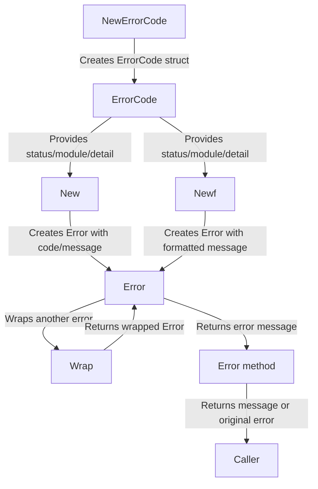

# Overview

To define a new error using the `errors` module, follow these steps:

## 1. Define an ErrorCode

Use `GetCode` or `NewErrorCode` to create a structured error code with HTTP status, module, and detail code.
You can reuse constants from the `net/http` package (e.g., `http.StatusBadRequest` is 400) to make error codes more readable and meaningful.

```go
import (
	"github.com/voidforge-studios/unlimit/errors"
	"net/http"
)

// Create an error code for HTTP 404, module 2, detail 5
code := errors.GetCode(http.StatusNotFound, 2, 5)
errCode := errors.NewErrorCode(code)

// Module constants definition.
const (
	ModuleCommon = 0
)

// Common module error codes definition.
var (
	ErrInvalidRequest = errors.NewErrorCode(errors.GetCode(http.StatusBadRequest, ModuleCommon, 1))
	ErrUnauthorized   = errors.NewErrorCode(errors.GetCode(http.StatusUnauthorized, ModuleCommon, 1))
	ErrInternalServer = errors.NewErrorCode(errors.GetCode(http.StatusInternalServerError, ModuleCommon, 1))
	ErrNoResponse     = errors.NewErrorCode(errors.GetCode(http.StatusInternalServerError, ModuleCommon, 2))
	ErrNotFound       = errors.NewErrorCode(errors.GetCode(http.StatusNotFound, ModuleCommon, 1))
)
```

## 2. Create an Error

Use `errors.New` to create an error with a message, or `errors.Newf` for a formatted message.

```go
// Create a new error with a custom message
err := errors.New(errCode, "resource not found")

// Or create a formatted error message
err := errors.Newf(errCode, "resource %s not found", "user")
```

## 3. Wrap an Existing Error

You can wrap a lower-level error with your application error for better context.

```go
baseErr := errors.New(errCode, "base error")
wrappedErr := baseErr.(*errors.Error).Wrap(someOtherError)
```

## 4. Access Error Information

You can access the error code, message, and metadata from the error object.

```go
appErr := err.(*errors.Error)
fmt.Println(appErr.ErrorCode) // structured error code
fmt.Println(appErr.Message)   // error message
fmt.Println(appErr.Metadata)  // optional metadata
```

## Example

```go
code := errors.GetCode(400, 1, 42)
errCode := errors.NewErrorCode(code)
err := errors.Newf(errCode, "invalid input: %s", "missing field")
fmt.Println(err.Error()) // Output: invalid input: missing field
```

## Summary

- Use `GetCode` and `NewErrorCode` to define structured error codes.
- Use `New` or `Newf` to create errors with messages.
- Use `Wrap` to add context from other errors.
- Access error details via the `Error` struct.

Refer to the flowchart below for the error creation process:


